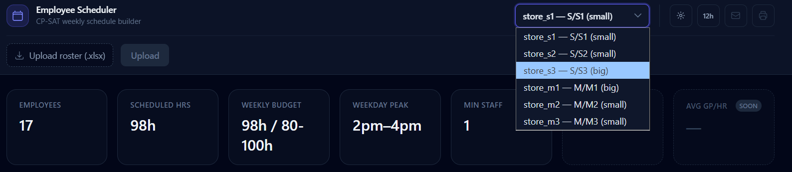
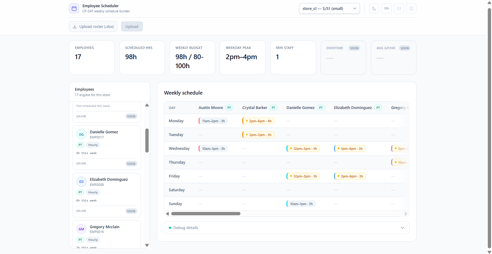
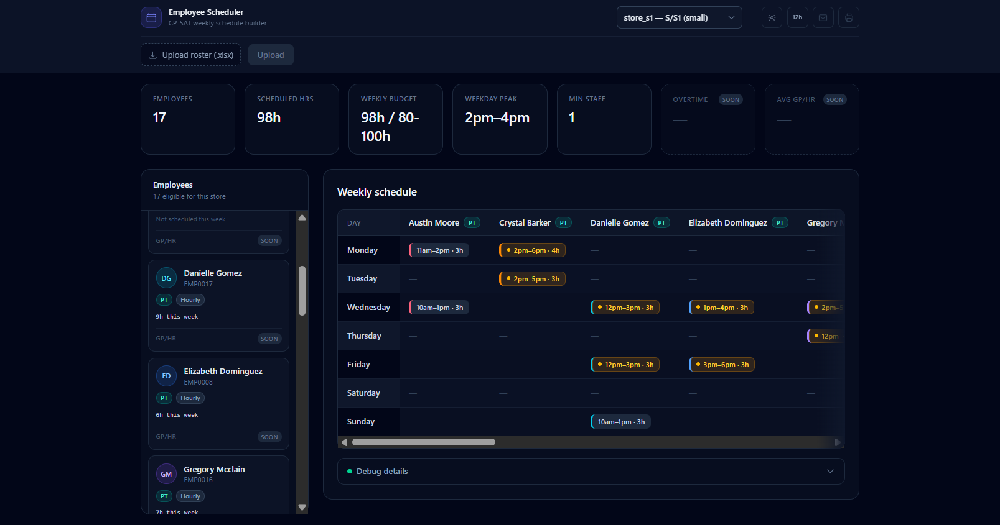
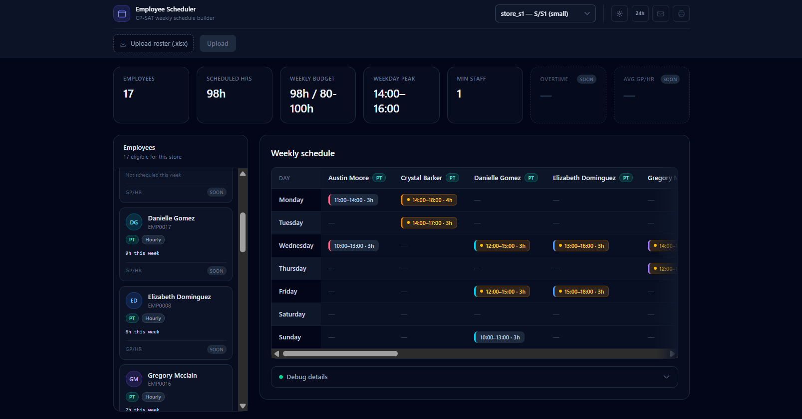
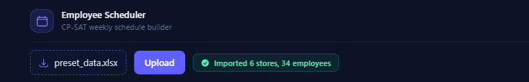
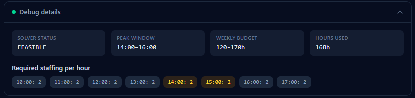

# Employee Scheduler

A backend-first employee scheduling system. A company or freelancer uploads
their own employee/store roster as an Excel workbook, and gets back a
feasible weekly schedule generated by a constraint solver — respecting
brand/branch transfer rules, staffing minimums, shift-length limits, and
weekly labor budgets, with peak hours detected from real hourly sales data
rather than guessed.

The pipeline: **Excel upload → MongoDB → FastAPI → React**. Excel is the
data connector (either the bundled preset dataset or a user's own workbook),
MongoDB is the internal working store, FastAPI exposes the import/scheduling
logic over HTTP, and a React frontend lets a user upload a roster, pick a
store, and view its generated schedule.

## Screenshots

| | |
|---|---|
|  **Store selector** — dropdown listing every seeded store with its brand, branch, and size tier. |  **Dashboard (light theme)** — metrics row, employee sidebar, and weekly schedule grid. |
|  **Dashboard (dark theme, default)** — same view with the dark palette and colored shift accents. |  **24-hour time format** — the am/pm ⟷ 24h toggle applied to a "big" tier store (`store_s3`, MFC minimum 2). |
|  **Excel upload** — confirmation banner after importing a workbook (6 stores, 34 employees). |  **Debug panel** — solver status, detected peak window, weekly budget usage, and required staffing per hour. |

## Tech stack

- Python (backend), JavaScript/React (frontend)
- FastAPI (`api/main.py`), served via uvicorn
- React + Vite + Tailwind CSS (`frontend/`) — the primary UI
- MongoDB (via pymongo) — internal working store
- Google OR-Tools CP-SAT solver — schedule generation
- Excel, via pandas/openpyxl — the preset dataset or a user-uploaded workbook
- Faker + random — one-time generation of the preset dataset (not used at
  request time)

## Architecture

```
Excel workbook (preset file, or a user's own upload)
        │  Stores / Employees / Hourly_Sales sheets
        ▼
db/excel_import.py           validates + maps rows to store/employee docs
        ▼
MongoDB                       internal working store (stores, employees)
        ▼
scheduler/                    peak-hour detection + CP-SAT weekly scheduling
        ▼
api/main.py (FastAPI)         POST /upload, GET /stores, GET /schedule/{id}
        ▼
frontend/ (React + Vite)      upload a roster, pick a store, view the schedule
```

Two ways data reaches MongoDB:

- **`POST /upload`** (used by the frontend) — accepts an uploaded `.xlsx`
  file, validates it through `db/excel_import.py`, and replaces the
  `stores`/`employees` collections.
- **`python -m db.seed_data`** (CLI) — reads `data/preset_data.xlsx` by
  default (`seed_from_excel()`); a random-generation demo path
  (`seed_from_random_data()`) also exists but isn't the default.

## Domain rules (v1)

- Two independent brands, each with three branches: S (S1, S2, S3) and M (M1,
  M2, M3). Employees can only transfer between branches of the same brand.
- Store size tiers (independent of brand): small stores require a minimum of
  1 worker on the floor (MFC), big stores require a minimum of 2.
- During peak hours (the window of consecutive hours where most sales occur),
  minimum staffing is 2 employees regardless of the MFC baseline.
- Store hours are fixed at 10am-6pm for v1.
- Employees are hourly, full-time (6-8 hr shifts) or part-time (3-7 hr shifts).
- Weekly budget hours: small stores 80-100 hrs/week, big stores 120-170
  hrs/week.
- Lunch hour scheduling, Excel export, and the full ADP-style employee schema
  are explicitly out of scope for v1.

## Features implemented

- **Excel import & validation** (`db/excel_import.py`) — reads Stores/
  Employees/Hourly_Sales sheets, validates every row through the same
  brand/branch/shift-length rules as the domain models, and returns a clear
  error (not a crash) on malformed data, e.g. a `Store_Code` mismatch between
  sheets.
- **Brand-block staffing rule** — employees are only eligible to work
  branches of their own brand (`scheduler/staffing_rules.py`).
- **MFC minimums** — 1 worker for small stores, 2 for big, derived from each
  store's size tier.
- **Peak-hour detection from real sales data** (`scheduler/peak_hours.py`) —
  finds the highest-average contiguous 2-3 hour window from each store's
  actual hourly sales, not a hardcoded window.
- **CP-SAT weekly scheduling** (`scheduler/generate_schedule.py`) — one CP-SAT
  model per store enforcing hourly coverage, FT/PT shift-length limits,
  single-block shift contiguity, and the store's weekly labor budget.
- **Upload-your-own-data flow** — `POST /upload` replaces the seeded data
  with whatever workbook a user provides, matching the same schema.
- **Dark/light theme toggle** — a real second theme (not just a color swap
  on one component), persisted to `localStorage`.
- **12h/24h time format toggle** — reformats every hour label in the app
  client-side from the raw hour data already in the API response.

## Setup

1. Create and activate a virtual environment:
   ```
   python -m venv venv
   source venv/bin/activate        # on Windows: venv\Scripts\activate
   ```
2. Install dependencies:
   ```
   pip install -r requirements.txt
   ```
3. Create a `.env` file in the project root with your MongoDB credentials:
   ```
   MONGO_URI=<your connection string>
   MONGO_DB_NAME=<your database name>
   ```
4. Seed the database from the preset Excel dataset:
   ```
   python -m db.seed_data
   ```
   This pings MongoDB first to confirm the connection works, then
   (re)populates the `stores` and `employees` collections. You can also skip
   this and upload your own workbook once the frontend is running.
5. Run the FastAPI backend:
   ```
   uvicorn api.main:app --reload --port 8000
   ```
6. In a separate terminal, install and run the React frontend:
   ```
   cd frontend
   npm install
   npm run dev
   ```
   Open the printed local URL (e.g. `http://localhost:5173`). Upload an Excel
   workbook (or rely on data already seeded via `db.seed_data`), pick a store
   from the dropdown, and view its weekly schedule as a day x employee grid,
   with a collapsible debug panel (detected peak window, required staffing
   per hour, weekly budget usage, and solver status).

## Project structure

```
employee-scheduler/
├── .env                          # local only, not checked in
├── config/settings.py            # domain constants (brands, MFC minimums,
│                                  # shift ranges, weekly budgets, store hours)
├── data/preset_data.xlsx          # source-of-truth preset seed data
├── data/generate_preset_data.py   # one-time generator that produced it
├── db/connection.py               # MongoDB connection (reads .env)
├── db/excel_import.py             # reads a workbook into store/employee docs
├── db/seed_data.py                # seeds MongoDB from Excel (default) or
│                                  # from freshly-generated random data (demo)
├── models/employee.py             # employee document schema + validation
├── models/store.py                # store document schema + validation
├── scheduler/peak_hours.py        # detects a store's peak hour window from
│                                  # its hourly sales data
├── scheduler/staffing_rules.py    # required staffing, brand-block eligible
│                                  # employees, weekly budget range
├── scheduler/generate_schedule.py # CP-SAT schedule generation (daily,
│                                  # weekly, all-store)
├── api/main.py                    # FastAPI app: upload, stores, schedule
├── frontend/                      # React + Vite + Tailwind UI
│   └── src/
│       ├── App.jsx                # layout shell, theme/time-format state
│       ├── api.js                 # fetch helpers for the FastAPI backend
│       ├── colors.js              # shared avatar/accent color palette
│       ├── hours.js               # client-side 12h/24h hour formatting
│       └── components/            # UploadPanel, StoreSelector, MetricsRow,
│                                  # Sidebar, ScheduleView, ScheduleGrid,
│                                  # DebugPanel
└── tests/test_scheduler.py        # placeholder, not yet implemented
```

## Scheduling approach

`scheduler/generate_schedule.py` builds a CP-SAT (constraint satisfaction)
model with Google OR-Tools - a feasibility model only, with no optimization
objective yet. For a given store and its brand-eligible employees, it creates
one boolean decision variable per employee per hour (per day, for the weekly
model) and enforces:

- **Coverage**: enough employees working each hour to meet the store's MFC
  minimum, bumped to 2 during the detected peak window
  (`scheduler/peak_hours.py`).
- **Shift length**: each employee's daily hours are either 0 (not working
  that day) or within their FT (6-8h) / PT (3-7h) range.
- **Contiguity**: an employee's working hours in a day form a single
  unbroken block, not scattered hours.
- **Weekly budget** (weekly model only): total hours across all employees
  and all 7 days fall within the store's weekly budget range (80-100h for
  small stores, 120-170h for big stores).

The solver returns a structured schedule (or a clear `INFEASIBLE` result) -
`generate_daily_schedule` for one store/one day, `generate_weekly_schedule`
for one store/one week, and `generate_full_schedule` for every seeded store.

## Status / Roadmap

**Implemented:** domain models, Excel import/validation (preset file or
user upload), peak-hour detection from real sales data, staffing rules
(brand-block, MFC minimums, weekly budgets), CP-SAT weekly schedule
generation, a FastAPI backend, and a React frontend with a working
upload → select store → view schedule flow, dark/light theme, and 12h/24h
time format.

**Deferred to v2:**
- Excel export of generated schedules (downloadable deliverables — distinct
  from Excel as an input connector, which is implemented)
- GP/Hr and overtime/break tracking (currently shown as clearly-marked
  "Soon" placeholders in the UI)
- An optimization objective for schedule generation (currently feasibility
  only, no cost/preference minimization)
- The full ADP-style employee schema / Miro board org hierarchy fields
  (beyond the lightweight ADP-flavored columns already in the Employees
  sheet)
- Automated tests (`tests/test_scheduler.py` is still a placeholder)
- "Copy Email" and "Print" toolbar actions (currently disabled placeholders)
- Lunch hour scheduling
